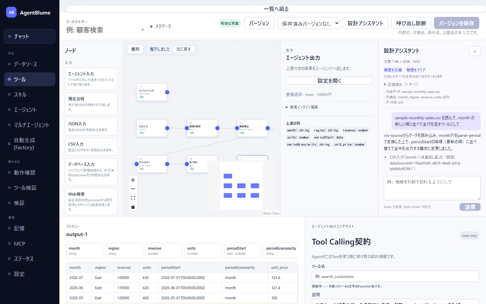
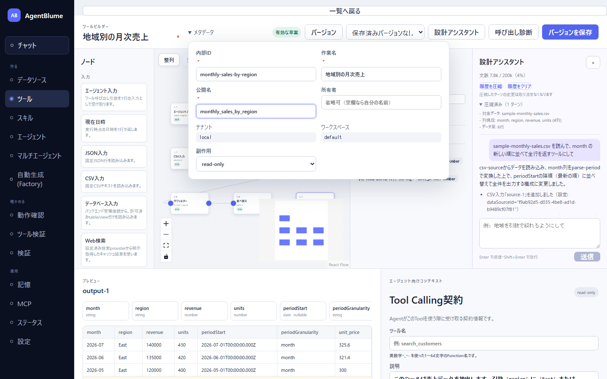
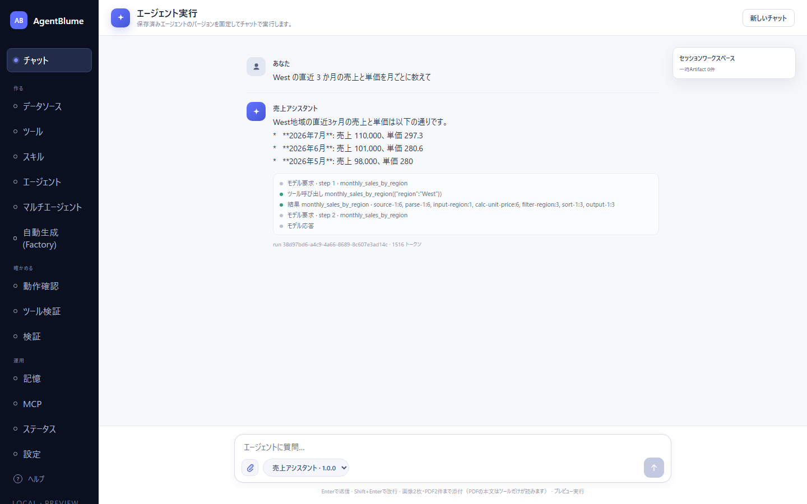
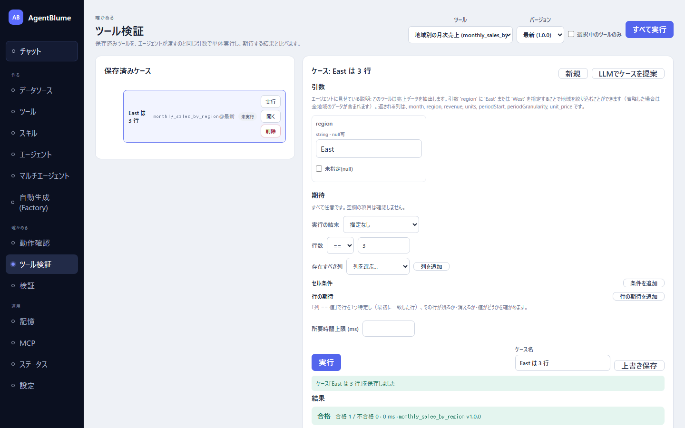

# データからエージェントを作る（通し）

同梱サンプルの月次売上データから、「地域を指定すると月ごとの売上と単価を答えるエージェント」を 1 体作る。データを確かめ、設計アシスタントと会話してツールを作り、エージェントに持たせて会話し、ツール検証で結果を確かめるところまでを 1 本通す。

- 所要時間: 30〜40 分（うち、設計アシスタントの返答待ちが合計 6 分ほど）
- 使うもの: 同梱サンプル `sample-monthly-sales.csv`、メインモデル（本節は LM Studio の `google/gemma-4-12b` で通した）

> 設計アシスタントとエージェントの返答は、モデルや実行のたびに少しずつ変わる。本節に載せた返答は実際に得た**例**である。違う返答が来たら、各段階の「確かめること」を見て進めればよい。

## 0. 準備

1. AgentBlume を起動し、ブラウザで画面を開く（[インストールと起動](../01-getting-started/01-install-and-start.md)）。
2. 「設定」の「モデルプロバイダ」で「メインモデル」を設定し、「テスト」で `ok` が出ることを確かめる（[モデルの設定](../01-getting-started/02-model-settings.md)）。
3. サンプルを読み込む。左ナビの「チャット」に出る「AgentBlumeへようこそ」のカードの「サンプルを読み込んで試す」を押す（データソースが 1 件も無いときは、「データソース」画面の「サンプルを読み込む」でもよい）。

## 1. データを確かめる

1. 左ナビの「データソース」を開く。
2. 「登録済みソース」に `sample-monthly-sales.csv`（CSV · 169 B）があることを確かめる。

中身は 2 地域 × 3 か月の 6 行である。

| month | region | revenue | units |
|---|---|---|---|
| 2026-05 | East | 120000 | 400 |
| 2026-05 | West | 98000 | 350 |
| 2026-06 | East | 135000 | 420 |
| 2026-06 | West | 101000 | 360 |
| 2026-07 | East | 140000 | 430 |
| 2026-07 | West | 110000 | 370 |

自分のデータを使うときは、この画面の「ファイルをアップロード」で CSV か JSON を登録する（[データを登録する](../02-data/01-register-data.md)）。列の中身は、ツールを作るときにプレビューで見られるほか、次の段階で設計アシスタントに聞くこともできる。

## 2. 設計アシスタントでツールを作る

ここが本節の中心である。指示のコツは [設計アシスタントと一緒にツールを設計する](../03-tools/05-design-assistant.md) にまとめてある。

### 2-1. ツール作成画面と設計アシスタントを開く

1. 左ナビの「ツール」を開き、「新規作成」を押す。
2. 画面上部の「設計アシスタント」を押す。右に「設計アシスタント」の欄が開く。
3. キャンバスに見本の 2 ノード（「JSON入力」と「行フィルター」）がある。1 つずつクリックして `Delete` キーで消し、キャンバスを空にする。

### 2-2. データについて聞く（質問だけ）

入力欄に次のように書いて `Enter` で送る。

```text
sample-monthly-sales.csv にはどんな列があり、何行ある？まだ何も作らないで
```

返答の例（6 秒）: 「sample-monthly-sales.csv には「month」「region」「revenue」「units」の4つの列があり、合計で6行のデータが含まれています。」

キャンバスは変わらない。見出しの下に「文脈 6.2k / 200k（3%）」のようなメーターが出る。

### 2-3. 骨組みを作らせる

```text
sample-monthly-sales.csv を読んで、month の新しい順に並べて全行を返すツールにして
```

返答の例（114 秒）: 「sample-monthly-sales.csv を読み込み、month（期間）を解析した上で、新しい順に並べ替えて全件を表示する構成に修正しました。」

確かめること:

- キャンバスに「CSV入力」「期間の解釈」「並べ替え」「行数制限」「エージェント出力」の 5 ノードがつながって置かれた。
- 返答の変更一覧に「CSV入力「…」を追加しました」「期間の解釈「…」を追加しました」「並べ替え「…」を追加しました」「行数制限「…」を追加しました」「エージェント出力「…」を追加しました」の 5 行が日本語で並んだ。
- 画面上部の表示が「有効な草案」になった。

### 2-4. 地域を引数で絞れるようにする

```text
region を引数で絞れるようにして。省略したら全地域を返す
```

返答の例（127 秒）: 「地域（region）をオプションの引数として追加し、フィルタを追加しました。指定がない場合はすべての地域が含まれます。」

確かめること: 変更一覧に「エージェント入力「…」を追加しました」（引数の宣言）と「行フィルター「…」を追加しました」（行フィルター）の**両方**があるか（変更一覧は日本語で出る。v53）。

実際に通したときは、返答の文は「フィルタを追加しました」なのに、変更一覧には「エージェント入力「input-region」を追加しました…」しか無かった。このように**足りないときは、ノード名を挙げて頼み直す**。

```text
変更一覧に行フィルターが無い。region 列を引数 region で絞る行フィルターを src-sales の直後に足して
```

返答の例（43 秒）: 「src-sales の直後に、引数 region を使用した行フィルタを追加しました。」 変更一覧に「行フィルター「filter-region」を追加しました（「src-sales」の後ろ・「parse-month」の手前）」が出た。

### 2-5. 単価の列を足す

```text
revenue を units で割った単価の列 unit_price を足して。小数第1位まで
```

返答の例（19 秒）: 「「revenue / units」を計算し、小数点第1位までの『unit_price』列を追加しました。また、エージェント向けの説明文にもこの新しい列を含めるよう更新しました。」

### 2-6. エージェント向けの説明文を書かせる

エージェントは、ツールを呼ぶ前にこの説明文を読んで、いつ・どんな引数で呼ぶかを決める。

```text
エージェント向けの説明文を書いて。引数 region に渡せる値（East / West）、省略時は全地域になること、返す列を入れて
```

返答の例（47 秒）: 「エージェント向けの説明文を更新しました。…」 画面下の「エージェント向けコンテキスト」の「説明」欄に、引数と返す列を書いた文が入る。

うまくいかなかった指示は、その返答の「この変更を取り消す」で戻せる（後の返答の変更も一緒に戻る）。

## 3. 整列して、プレビューで確かめる

1. キャンバス左上の「整列」を押す。ノードが処理の順に列へ並び、キャンバスの幅で折り返す。直後に「整列しました / 元に戻す」が出る。

   

   写真は別の回に同じ指示で通したときのもので、骨組みは「行数制限」の無い 4 ノード（ノード ID は `source-1`・`parse-1`・`sort-1`・`output-1`）で作られ、2-4 の行フィルターも 1 回目の指示で入った。ノードの数や ID が本文の例と違っても、下の「確かめること」を満たしていればよい。

2. 最後のノード（「エージェント出力」。写真の回では `output-1`）をクリックし、画面下の「プレビュー」を見る。

確かめること: 3 行（East の 3 か月）が新しい月から並び、`unit_price` 列（300、321.4、325.6）がある。プレビューに East だけが出るのは、行フィルターの「値」に入っている `East` が設計時の見本だからで、エージェントが呼ぶときは渡した引数（省略すれば全地域）で絞られる。

## 4. 名前を付けて保存する

1. 画面左上の表示名の欄（「例: 顧客検索」と薄く出ている）に `地域別の月次売上` と入れる。
2. 「メタデータ」を開き、「内部ID」に `monthly-sales-by-region`、「作業名」に `地域別の月次売上`、「公開名」に `monthly_sales_by_region` を入れる。「所有者」は空でよい（自分の名前が入る）。

   

3. 画面下の「エージェント向けコンテキスト」で、「ツール名」に `monthly_sales_by_region` を入れる（公開名と同じにしておくと分かりやすい。空のままでも、2-6 で書かせた説明文はちゃんと保存される）。
4. 「呼び出し診断」を押す。「ツール呼び出し診断 … 問題なし」「エラー 0 件 · 警告 0 件」と出て、「Function定義」「データソース解決」「サンプル実行」などの項目に ✓ が付く。
5. 「バージョンを保存」を押す。「保存しました バージョン 1.0.0」と出る。

保存できないときは、ボタンの下に理由（「内部ID、作業名、表示名、公開名が未入力です。」など）が出る。詳しくは [確認・保存・版](../03-tools/07-check-save-versions.md)、引数と説明文については [引数と Tool Calling 契約](../03-tools/06-arguments-and-contract.md)。

## 5. エージェントを作ってツールを持たせる

1. 左ナビの「エージェント」を開き、「新規作成」を押す。
2. 「定義」の「内部ID」に `sales-assistant`、「作業名」と「表示名」に `売上アシスタント`、「公開名」に `sales_assistant` を入れる。
3. 「ツール」の一覧で「地域別の月次売上」（`monthly_sales_by_region@1.0.0`）にチェックを入れる。
4. 「草案を生成」を押す。右の「システムプロンプト」に、役割とツールの使い方（`monthly_sales_by_region@1.0.0（地域別の月次売上）: input [region?:string] / output [...]` と「`?` 付きの引数は省略可能…」）を書いた下書きが入る。必要なら書き足す。
5. 「バージョンを保存」を押す。「保存しました バージョン 1.0.0」と「保存しました。ツール診断: 問題なし」が出る。

詳しくは [エージェントを作る](../04-agents/02-create-agent.md)、[ツール・スキル・Wiki・MCP を持たせる](../04-agents/03-attach-tools-and-more.md)。

## 6. チャットで会話する

1. 左ナビの「チャット」を開く。
2. 入力欄の左下の「チャット対象エージェント」のプルダウンで「売上アシスタント · 1.0.0」を選ぶ。
3. 次のように書いて `Enter` で送る。

```text
West の直近 3 か月の売上と単価を月ごとに教えて
```

返答の例（5 秒）: 「West地域の直近3ヶ月の売上と単価は以下の通りです。」に続けて、次の 3 行が箇条書きで返った。

- 2026年7月: 売上 110,000、単価 297.3
- 2026年6月: 売上 101,000、単価 280.6
- 2026年5月: 売上 98,000、単価 280



確かめること: 返答の下の記録に `ツール呼び出し monthly_sales_by_region({"region":"West"})` と、ノードごとの行数（写真の回では `source-1:6, … filter-region:3, … output-1:3`）が出ている。エージェントがツールに正しい引数を渡し、ツールが West の 3 行を返したことがわかる。数字はデータどおり（110000 ÷ 370 = 297.3）である。

呼び出しをもっと詳しく見たいときは「動作確認」画面を使う（[会話して確かめる・呼び出しを調べる](../04-agents/04-chat-and-inspect.md)）。

## 7. ツール検証でケースを残す

エージェントを通さずに、ツールだけを同じ引数で動かして結果を確かめ、あとで何度でも流せる「ケース」として残す。

1. 左ナビの「ツール検証」を開く。
2. 右上の「ツール」で「地域別の月次売上 (monthly_sales_by_region)」を選ぶ（「バージョン」は「最新」のまま）。
3. 「引数」の `region` に `East` と入れる。
4. 「期待」の「行数」を `==`、`3` にする。
5. 「実行」を押す。「結果」に「合格」「合格 1 / 不合格 0」と出て、出力の表と「ノード別の行数」が出る。
6. 「ケース名」に `East は 3 行` と入れ、「ケースとして保存」を押す。左の「保存済みケース」に並ぶ。



ツールやデータを変えたら、ここで「実行」（1 件）か「すべて実行」を押して、結果が変わっていないかを確かめる。詳しくは [ツール検証](../08-validation/01-tool-check.md)。

## できたもの

- ツール「地域別の月次売上」（引数 `region` は省略可。月の新しい順に、単価つきで返す）
- エージェント「売上アシスタント」（上のツールを持つ）
- ツール検証のケース「East は 3 行」

## うまくいかないとき

| 症状 | 原因 | 直し方（直す場所） |
|---|---|---|
| 設計アシスタントの入力欄が灰色 | メインモデルが未設定 | 「設定」→「モデルプロバイダ」で設定し、ブラウザを再読み込みする |
| 返答は「追加しました」なのにノードが無い | 返答の文と実際の変更が食い違った | 変更一覧を見て、足りないノードをノード名つきで頼み直す（2-4 の例） |
| ノードが画面の外にある | 既存のキャンバスに足したノードは上流の隣に置かれる。通常は自動で表示が合う | それでも見えなければキャンバス左上の「整列」 |
| 「バージョンを保存」が押せない | 表示名・メタデータが空、またはグラフにエラー | ボタンの下の理由を読んで埋める・直す |
| エージェントがツールを呼ばない・引数を間違える | 説明文が足りない | ツールの「説明」に引数の値と省略時の意味を書き、ツールを保存し直してから、エージェントを開いて「バージョンを保存」し直す（保存し直すと、ツールの最新版を使うようになる） |
| ツール検証が「不合格」 | 期待とツールの結果が違う | 表の「期待」と「実測」を見比べ、ツールか期待を直す |

設計アシスタントでの詳しい対処は [設計アシスタント「うまくいかないとき」](../03-tools/05-design-assistant.md#うまくいかないとき)。

## 次に読む

- [設計アシスタントと一緒にツールを設計する](../03-tools/05-design-assistant.md) — 結合・日付の引数・集計・壊れたツールの修理などの頼み方
- [Factory で作る（チュートリアル）](./02-build-with-factory.md) — 同じデータから、エージェント一式を自動で作らせる
- [シナリオとペルソナ](../08-validation/02-scenarios-and-personas.md) — エージェントの会話そのものを検証する
