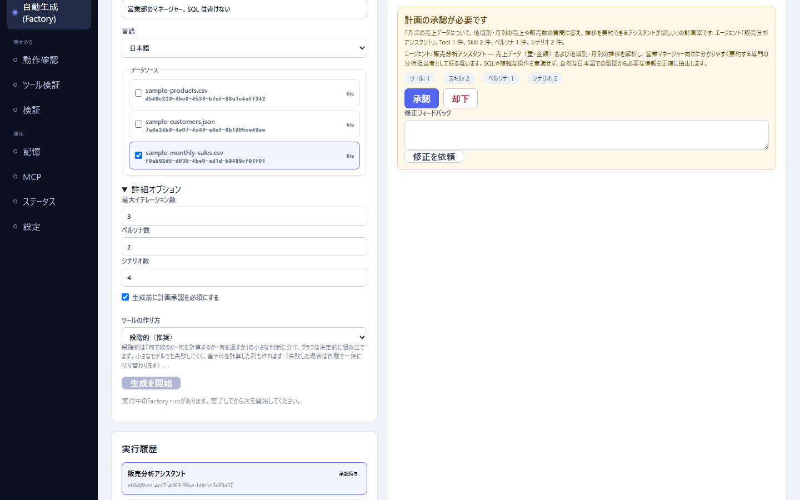
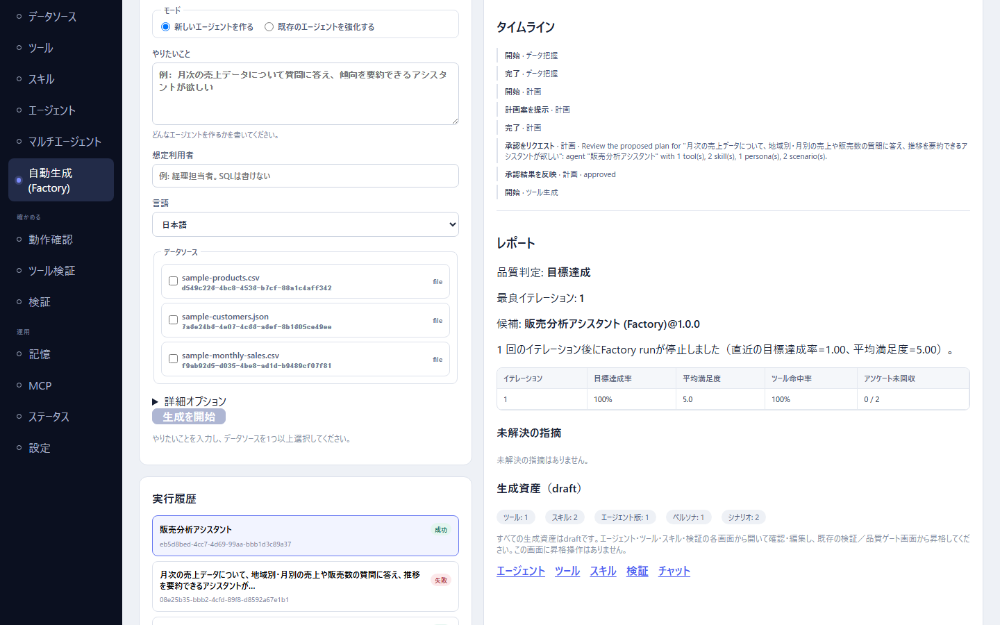

# Factory で作る

「やりたいこと」とデータを渡して、ツール・スキル・エージェント一式と、それを確かめる検証用の資産（ペルソナ・シナリオ）を Factory に自動で作らせる。同梱サンプル `sample-monthly-sales.csv` で 1 回通し、できたものを受け取って使い始めるところまでをやる。

- 所要時間: 入力に 5 分。そのあとの待ち時間は、実測で開始から完了まで約 5 分半（LM Studio の `google/gemma-4-12b`。計画の承認待ちの時間を含む）。
- 何から作ればよいかわからないときの近道である。自分で細かく設計したいときは [01 データからエージェントを作る](./01-build-an-agent-end-to-end.md) の方法を使う。

> 結果（計画の中身、できたツールの形、検証の成績）はモデルと実行のたびに変わる。本節に載せたものは実際に 1 回通したときの**例**である。

## 0. 準備

- メインモデルを設定しておく（[モデルの設定](../01-getting-started/02-model-settings.md)）。Factory はツール・スキル・エージェントを作るのにも、できたエージェントを疑似ユーザーと会話させて確かめるのにも、メインモデルを使う。
- サンプルを読み込んでおく（[01 の「0. 準備」](./01-build-an-agent-end-to-end.md#0-準備)）。
- Factory の実行は同時に 1 つだけである。ほかの実行が終わるのを待ってから始める。

## 1. やりたいことを書いて始める

1. 左ナビの「自動生成 (Factory)」を開く。
2. 「新規Factory実行」の「モード」で「新しいエージェントを作る」を選ぶ（最初から選ばれている）。
3. 「やりたいこと」に、どんなエージェントが欲しいかを書く。例:

   ```text
   月次の売上データについて、地域別・月別の売上や販売数の質問に答え、推移を要約できるアシスタントが欲しい
   ```

4. 「想定利用者」に、使う人を書く（任意）。例: `営業部のマネージャー。SQL は書けない`
5. 「言語」は「日本語」のまま。
6. 「データソース」で `sample-monthly-sales.csv` にチェックを入れる。
7. 「詳細オプション」を開き、「生成前に計画承認を必須にする」にチェックを入れる（最初は外れている）。入れておくと、作り始める前に計画を見て、承認・却下・修正の依頼ができる。ほかは既定のままでよい。

   | 項目 | 既定 | 意味 |
   |---|---|---|
   | 最大イテレーション数 | 3 | 検証 → 改善を最大何周するか |
   | ペルソナ数 | 2 | 検証で会話させる疑似ユーザーの人物像の数 |
   | シナリオ数 | 4 | 検証する会話の筋書きの数 |
   | ツールの作り方 | 段階的（推奨） | 「何で絞るか・何を計算するか・何を返すか」に分けて小さく決めさせる。失敗したら自動で「一括」に切り替わる |

8. 「生成を開始」を押す。右に実行の詳細が開き、「実行履歴」に 1 件増える。

「やりたいこと」が空か、データソースを 1 つも選んでいないと、ボタンの下に「やりたいことを入力し、データソースを1つ以上選択してください。」と出て始められない。

## 2. 計画を承認する

実行の詳細には「ステージ」「経過」と「タイムライン」が出て、進むたびに行が増える（「開始 · データ把握」「完了 · データ把握」「開始 · 計画」…）。

計画ができると、状態が「承認待ち」になり、「計画の承認が必要です」の枠が出る。実測では開始から約 2 分半〜3 分で出た。



枠には、作るエージェントの名前と説明、作るものの数が出る。写真の回の計画は次のとおりだった（例）。

- エージェント: 販売分析アシスタント — 売上データ（量・金額）および地域別・月別の推移を解析し、営業マネージャー向けに分かりやすく要約する専門の分析担当者として振る舞います。SQLや複雑な操作を意識せず、自然な日本語での質問から必要な情報を正確に抽出します。
- 「ツール: 1」「スキル: 2」「ペルソナ: 1」「シナリオ: 2」

エージェントの名前や作るものの数は回ごとに変わる（別の回では「売上分析アシスタント」「スキル: 1」だった）。

枠の上の文は日本語で出る（v53。以前は `Review the proposed plan for …` のような英語だった）。写真の回では「「月次の売上データについて、地域別・月別の売上や販売数の質問に答え、推移を要約できるアシスタントが欲しい」の計画案です: エージェント「販売分析アシスタント」、Tool 1 件、Skill 2 件、ペルソナ 1 件、シナリオ 2 件。」と出た（やりたいことの全文がそのまま入るので長くなる）。タイムラインの「承認をリクエスト」の行は、いまも `Review the proposed plan for …` の英語のまま出る。

- よければ「承認」を押す。
- 直してほしければ「修正フィードバック」に書いて「修正を依頼」を押す。
- やめるなら「却下」を押す。

## 3. 生成と検証を待つ

承認すると、ステージが「ツール生成」→「スキル生成」→「エージェント組み立て」→「検証資産の生成」→「検証」→「分析」→「改善」…と進む（検証で目標を満たすと、分析と改善は省かれてレポート作成へ進む。実測はそうなった）。途中でやめたいときは「取消」を押す（再開はできない）。

実測では、承認から約 3 分で完了した。タイムラインには次のような行が出た（抜粋）。

- 「ツールを生成 · ツール生成 · get_sales_performance (template: period-series@1.0.2; slots: periodColumn=month, valueColumns=[revenue, units], categoryColumn=region, …)」— 用意されたテンプレート（期間の推移）に、データの列を当てはめてツールを作った
- 「資産を保存 · スキル生成」「資産を保存 · エージェント組み立て」「資産を保存 · 検証資産の生成」
- 「シナリオ実行が完了 · 検証 · …: completed」（シナリオの数だけ）— できたエージェントを疑似ユーザーと会話させた
- 「イテレーションが完了 · 検証 · it.1」「実行完了 · レポート作成」

終わると、「実行履歴」と詳細の状態が「成功」になり、タイムラインの下に「レポート」が出る。「成功」は**最後まで走った**という意味で、できたエージェントの出来は次のレポートの「品質判定」で読む。

## 4. レポートを読む



写真の回のレポートは次のとおりだった（例）。

| 項目 | 実測 | 読み方 |
|---|---|---|
| 品質判定 | 目標達成 | 「目標達成」「目標未達」「検証できず」のどれか。「検証できず」はそもそも測れなかった（全シナリオが失敗した等）という意味で、未達とは別 |
| 最良イテレーション | 1 | 検証 → 改善を回したうち、成績がいちばん良かった周。1 周目で目標を満たしたので、改善は回らなかった |
| 候補 | `販売分析アシスタント (Factory)@1.0.0` | 使うことを勧めるエージェントの版。表示名が引けるときは表示名で出る（v53。それ以前・表示名が空のときは `22cfee24-…@1.0.0` のような内部IDで出る）。**実行を始めた画面を開いたまま完了を待つと、内部ID（`fc90388d-…@1.0.0`）のまま出た**。ブラウザを再読み込みして「実行履歴」からその実行を選ぶと表示名になる（写真は再読み込みしたあと） |
| イテレーションの表 | 目標達成率 100%、平均満足度 5.0、ツール命中率 100%、アンケート未回収 0 / 2 | 疑似ユーザーとの会話で、目標を果たせた割合・満足度（5 段階）・期待したツールを呼べた割合 |
| 未解決の指摘 | 未解決の指摘はありません。 | 検証で見つかって直しきれなかった問題 |
| 生成資産（draft） | ツール: 1、スキル: 2、エージェント版: 1、ペルソナ: 1、シナリオ: 2 | できたものの数。すべて draft（下書き）で保存される |

表の上の 1 行の総括は日本語で出る（v53。以前は `Factory run stopped after 1 iteration(s); …` のような英語だった）。例えば「1 回のイテレーション後にFactory runが停止しました（直近の目標達成率=1.00、平均満足度=5.00）。」のように出る。ただし、改善を回した回（別の回。「目標未達」で 2 周した）では、この行に改善の説明が英語のまま（`Revised the system prompt to mandate …`）出て、品質判定の下の理由も `avgSatisfaction 3.00 is below the target 4` と英語だった。

## 5. できたものを確かめて使い始める

> 本節の 3（タイムラインの行）と 5 の名前・会話例は、写真とは別の回（エージェント「売上分析アシスタント」）のものである。写真の回は、前の回で Factory が作ったツールを作り直さずに使い回した（タイムラインに「ツールを再利用 · ツール生成 · fetch_sales_data: factory_tool_asset_monthly_sales_by_region_…」の行が出た）。

レポートの下の「エージェント」「ツール」「スキル」「検証」「チャット」は、それぞれの**画面**を開くリンクである（作られたものを直接開くわけではない）。実測では、ツールとエージェントは各画面の一覧に `(Factory)` の付いた名前で並んだ。

### ツールを見る

1. 「ツール」画面の一覧で、実測では「売上・販売数パフォーマンス取得 (Factory)」（`factory_tool_asset_get_sales_performance_…@1.0.0`）の「開く」を押す。
2. キャンバスに「CSV入力」「期間の解釈」、3 つの「行フィルター」（粒度・地域・期間）、「並べ替え」「行数制限」「エージェント出力」と、引数の「エージェント入力」が並んでいた。
3. 「エージェント向けコンテキスト」の「説明」には、引数ごとの書式が書かれていた（例: 「granularity (必須): 期間の粒度。month / quarter / half / year / fiscal-year のうちデータにあるものを、この綴りのまま渡す」「period_from (省略可): この日以降に始まる期間（ISO 日付…）」「categories (省略可): region の値をカンマ区切りで渡す」）。

形を直したいときは、この画面で「設計アシスタント」を開いて会話で直せる（[設計アシスタント](../03-tools/05-design-assistant.md)）。直したら「バージョンを保存」し、エージェントも開いて「バージョンを保存」し直す（保存し直すと、ツールの最新版を使うようになる）。

### エージェントと会話する

1. 左ナビの「チャット」を開く。
2. 「チャット対象エージェント」で、実測では「売上分析アシスタント (Factory) · 1.0.0」を選ぶ。
3. 質問を送る。実測の例:

   ```text
   East と West の売上の推移を比べて、要約して
   ```

   返答（13 秒）は、East が 120,000 → 135,000 → 140,000、West が 98,000 → 101,000 → 110,000 と増えていること、販売数の推移、「売上規模および販売数の絶対数は東部（East）が常に上回っている」という比較を、見出しと箇条書きでまとめたものだった。記録には `ツール呼び出し get_sales_performance({"categories":"East,West","granularity":"month"})` が出た。

### 検証資産を見る

Factory が作ったペルソナとシナリオは「検証」画面にある。自分でシナリオを足して、会話の品質を確かめ続けられる（[シナリオとペルソナ](../08-validation/02-scenarios-and-personas.md)）。本番で使う前の昇格（draft から正式な版へ）は、Factory の画面ではなく品質ゲートで行う（[品質ゲート](../08-validation/04-quality-gate.md)）。

ツールだけを確かめるなら、[01 の「7. ツール検証でケースを残す」](./01-build-an-agent-end-to-end.md#7-ツール検証でケースを残す) と同じ手順で、このツールにもケースを作っておくとよい。

## うまくいかないとき

| 症状 | 原因 | 直し方（直す場所） |
|---|---|---|
| 「生成を開始」が押せない | やりたいことが空、またはデータソースを選んでいない。ほかの Factory 実行が動いている | 入力を埋める。「実行中のFactory runがあります。」と出ていれば、その実行が終わるまで待つ |
| 「承認待ち」のまま進まない | 「生成前に計画承認を必須にする」を入れている | 「計画の承認が必要です」の枠で「承認」を押す |
| 待ち時間が長い | 生成・検証のたびにモデルを何度も呼ぶ。ほかの機能が同じモデルを使っていると遅くなる | 「詳細オプション」でイテレーション数・シナリオ数を減らす。待てなければ「取消」 |
| 品質判定が「目標未達」や「検証できず」 | できたエージェントが検証で目標に届かなかった、またはそもそも測れなかった | レポートの理由と「未解決の指摘」を読み、できたツールを設計アシスタントで直す（[設計アシスタント](../03-tools/05-design-assistant.md)） |
| できたツールの形が思っていたのと違う | Factory はテンプレートや段階的な判断で形を決める | ツールを開き、設計アシスタントで直して保存し、エージェントを保存し直す |

## 次に読む

- [Factory（リファレンス）](../07-factory/01-factory.md) — 画面の各項目と「既存のエージェントを強化する」モード
- [設計アシスタントと一緒にツールを設計する](../03-tools/05-design-assistant.md) — できたツールを会話で直す
- [シナリオとペルソナ](../08-validation/02-scenarios-and-personas.md) — Factory が作った検証資産を読む・足す
- 開発者向けの詳細: [docs/16 Agent Factory](../../16-agent-factory.md)
