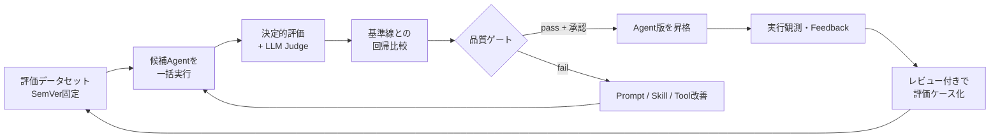
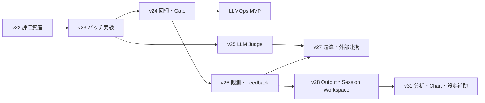

# LLMOps 実装計画: 評価データから品質ゲート・運用還流まで

> 対象: agentblume Phase 4「評価と運用」
> 前提: Increment 21 まで完成。2026-07-10 時点で `npm test` 824件、`npm run typecheck`、`npm run depcruise` が green。
> 方針: ローカルファーストを維持し、外部の評価・観測・CI製品は Port / Adapter で後から接続する。

## 1. 目的と成功条件

LLMOps の最初の完成形を、次の再現可能なループとして定義する。



次をすべて満たした時点を LLMOps MVP 完了とする。

- 同じ `dataset@version`、`agent@version`、評価設定で実験を再実行できる。
- 候補版と基準版をケース単位・集計値の両方で比較できる。
- 品質、失敗率、レイテンシ、トークン量の閾値を機械判定できる。
- gate pass だけでは公開せず、人の承認を経て Agent の状態を変更する。
- 評価実行の入力、出力、使用版、採点理由、Run trace を後から追跡できる。
- 実行履歴や利用者フィードバックから評価ケース候補を作り、レビュー後にデータセットへ追加できる。

## 2. 現状と不足

### 再利用する実装

- `Scenario` / `ScenarioRun`: SemVer固定の複数ターン検証、疑似ユーザー、アンケート、Tool hit率、usage。
- `RunRecord` / `RunRepository`: Agent版、応答、usage、最小trace、失敗のSQLite永続化。
- `AgentEvaluatorPort` / `MastraEvalsEvaluator`: 1入力・1出力の決定的なオフライン採点。
- Agent / Skill / Tool のSemVer、公開状態、tenant/workspace分離。
- InMemory / SQLite の同一Repository契約テストと Composition Root。

### 追加が必要な境界

| 領域 | 現状 | 追加するもの |
|---|---|---|
| 評価資産 | Scenarioは1件ずつ実行 | バージョン付き Dataset / EvaluatorProfile / GatePolicy |
| 実験 | 同期の単発実行 | 永続ジョブ、一括実行、再試行、キャンセル、進捗 |
| 評価結果 | 応答turn内の一時表示 | ケース結果・集計結果の永続化、失敗理由 |
| 回帰 | 同一Scenarioの履歴表示のみ | baseline/candidate差分と品質ゲート |
| Judge | code scorerのみ | バージョン付きrubric、明示したJudgeモデルによる採点 |
| 観測 | 独自Run trace、tokens | latency内訳、モデル/config fingerprint、OTel export、retention |
| コスト | 価格情報なし | PricingPortと「推定値」であることを含むcost snapshot |
| 還流 | Run→Memory提案 | FeedbackとEvaluationCase提案、人手レビュー |
| 昇格 | Agent stateはあるがゲート非連動 | GateReportに基づく承認付き状態遷移 |

## 3. アーキテクチャ上の決定

1. **評価定義と評価結果を分離する。** Dataset、EvaluatorProfile、GatePolicy は不変のSemVer資産、Experiment は実行時snapshotを持つ履歴とする。
2. **既存の実行経路を再利用する。** 評価専用のAgent runnerを作らず、`RunAgentPreviewUseCase` と `RunScenarioUseCase` をオーケストレートする。
3. **長時間処理は非同期化する。** `POST /experiments` は `202` を返し、ローカルでは `InProcessExperimentWorker` が逐次実行する。将来は同じPortへ外部queue adapterを接続する。
4. **部分失敗を実験全体の消失にしない。** ケースごとの `succeeded | failed | cancelled` を保存し、集計に失敗率を含める。
5. **比較可能性を先に検証する。** Dataset版、EvaluatorProfile版、反復回数が異なる実験は、既定ではbaseline比較を拒否する。
6. **昇格は fail closed。** gate未実行、fail、結果期限切れ、対象版不一致のいずれかなら状態遷移を拒否する。
7. **外部SDKをdomain/applicationへ持ち込まない。** Mastra、OpenTelemetry、将来の評価SaaS/queue/CI SDKはadapterに限定する。
8. **原文の二次利用はレビュー必須。** Run/Feedbackから抽出したデータは直接Datasetへ入れず、マスキング状態を持つ提案を経由する。

## 4. 中核データモデル

```typescript
interface EvaluationDataset {
  metadata: VersionedMetadata;
  cases: EvaluationCase[];
}

type EvaluationCase =
  | {
      id: string;
      kind: 'turn';
      input: string;
      reference?: string;
      expectedTools?: string[];
      tags: string[];
      source: 'manual' | 'import' | 'run-feedback';
    }
  | {
      id: string;
      kind: 'scenario';
      scenario: { id: string; version: SemVer };
      tags: string[];
      source: 'manual' | 'import' | 'run-feedback';
    };

interface EvaluatorProfile {
  metadata: VersionedMetadata;
  metrics: {
    id: string;
    kind: 'code' | 'judge';
    weight: number;
    required: boolean;
    scorer: string;
    rubricRef?: { id: string; version: SemVer };
  }[];
}

interface Experiment {
  id: string;
  scope: TenantScope;
  target: { agentId: string; version: SemVer };
  dataset: { id: string; version: SemVer };
  evaluatorProfile: { id: string; version: SemVer };
  repetitions: number;
  status: 'queued' | 'running' | 'completed' | 'failed' | 'cancelled' | 'interrupted';
  snapshot: {
    provider: string;
    model: string;
    modelConfigHash: string;
    sourceRevision?: string;
  };
  progress: { completed: number; total: number };
  startedAt?: string;
  finishedAt?: string;
}

interface ExperimentCaseResult {
  experimentId: string;
  caseId: string;
  repetition: number;
  status: 'succeeded' | 'failed' | 'cancelled';
  runIds: string[];
  scores: EvaluationScore[];
  latencyMs: number;
  usage: RunUsage;
  estimatedCost?: { amount: number; currency: string; priceSnapshotId: string };
  error?: { code: string; message: string; retryable: boolean };
}

interface GatePolicy {
  metadata: VersionedMetadata;
  rules: GateRule[];
}

type GateRule =
  | { metric: string; operator: 'gte' | 'lte'; threshold: number }
  | { metric: string; operator: 'max-regression'; threshold: number }
  | { metric: string; operator: 'required-case-pass'; tags?: string[] };
```

永続化は既存規約どおり、各集約に domain repository interface、InMemory adapter、SQLite adapter、共有contract suiteを用意する。Experimentのsnapshotは実行後に書き換えない。

## 5. 増分計画

### Increment 22: 評価資産の版管理

**Status:** Implemented (2026-07-10)

**目的:** 再現可能な評価入力と採点設定を先に固定する。

- domain: `EvaluationDataset`、`EvaluationCase`、`EvaluatorProfile`、serialization、エラー型。
- application: save/query/import/export use case。CSVは `turn` ケース、JSONは全case kindを扱う。
- adapters: InMemory / SQLite repository と共有contract test。
- API:
  - `POST/GET /evaluation-datasets`
  - `GET /evaluation-datasets/:id?version=`
  - `GET /evaluation-datasets/:id/versions`
  - `POST /evaluation-datasets/import`
  - EvaluatorProfileも同型のCRUD/read API。
- UI: Validationに **Datasets** タブを追加。ケース編集、タグ、reference、期待Tool、Scenario参照、import/export、保存前validationを提供。
- validation: case id重複、空入力、存在しないScenario版、未知scorer、負weightを拒否する。

**DoD:** 同じDataset版のJSON exportが安定し、再importして意味的に等価。tenant分離とSemVer bumpをRepository契約で保証する。

### Increment 23: 永続バッチ実験

**Status:** Implemented (2026-07-10)

**目的:** 固定Agent版をDataset全件に対して実行し、途中結果を失わず保存する。

- domain: `Experiment`、`ExperimentCaseResult`、状態遷移と進捗不変条件。
- application: `CreateExperiment`、`RunExperiment`、`CancelExperiment`、`QueryExperiments`。
- port: `ExperimentWorkerPort`。local adapterは同時実行数1を既定とし、設定で小さく増やせる。
- turn case: 既存Agent実行 → Run保存 → `AgentEvaluatorPort`で採点。
- scenario case: 既存Scenario実行 → ScenarioRun/子Run参照 → 達成率、Tool hit率、survey値を正規化。
- retry: provider timeout/一時障害だけを指数backoff付きで最大2回。入力不正やgate失敗は再試行しない。
- restart: 起動時に `running` を `interrupted` へ遷移し、明示resumeで未完了caseのみ再開する。
- API: `POST /experiments` (`202`)、list/detail/cancel/resume、case results取得。
- UI: **Experiments** タブに進捗、case状態、Run traceリンク、失敗理由を表示。

**DoD:** 途中キャンセル・プロセス再起動・ケース単位失敗でも、完了済み結果が保持され二重実行されない。

### Increment 24: 回帰比較と品質ゲート（LLMOps MVP）

**Status:** Implemented (2026-07-10)

**目的:** candidateをbaselineと定量比較し、自動判定と人手承認を可能にする。

- 集計: success/goal達成/Tool hit/各scorerの平均・中央値、p50/p95 latency、tokens/case、失敗率。
- 反復実行: `repetitions=1..10`。平均だけでなく分布、標準偏差、サンプル数を表示する。
- comparison: 同じcase idのbaseline/candidate差分、改善/悪化/比較不能を記録。
- `GatePolicy` / `GateReport`を版管理し、閾値、最大回帰、required tagケースを評価する。
- promotion:
  - `POST /agents/:id/versions/:version/promotion-requests`
  - GateReport pass、対象版一致、未失効を検証。
  - MVPでは `draft -> in-review -> published` の状態遷移と承認記録まで。外部環境へのdeployは行わない。
- UI: baseline選択、差分表、悪化ケース絞り込み、gate判定、承認/差し戻し。
- CI用にUI非依存の `npm run llmops:gate -- --experiment <id>` を追加し、pass=0 / fail=1 / 実行不備=2で終了する。

**DoD:** 固定fixtureで意図的に劣化したAgent版をgateが拒否し、良化版だけが承認付きでpublishedへ進める。ここまでを最初の出荷単位とする。

### Increment 25: LLM-as-Judge

**Status:** Implemented (2026-07-10)

**目的:** code scorerで測れない正確性、指示遵守、安全性、回答品質をrubricで評価する。

- `JudgeRubric`をSemVer資産化し、観点、0..1の採点基準、必須理由、reference利用規則を保持する。
- `JudgeEvaluatorPort`を追加し、既存 `AgentEvaluatorPort` から合成する。Judgeモデルは評価対象モデルと別に明示固定する。
- JSON structured outputを必須にし、schema不適合は採点失敗として保存する。
- prompt injection対策として、評価対象の入出力を命令ではなく引用データ領域へ隔離する。
- 順序バイアスを避けるため、pairwise比較ではcandidate/baselineの提示順を決定的seedで入れ替える。
- scorer名、rubric版、judge model/config、理由、失敗をcase resultにsnapshot保存する。
- Judge障害時は required metricならgate fail、optional metricなら欠損扱いとし、暗黙の0点化をしない。

**DoD:** Scripted judgeの契約テスト、schema破損、timeout、提示順反転、必須/任意metricの失敗規則がgreen。

### Increment 26: 観測、コスト、利用者Feedback

**Status:** Implemented (2026-07-10)

**目的:** 評価外の実行も同じ識別子と指標で観測し、改善候補を収集する。

- `RunRecord`へ後方互換な `purpose`、provider/model/config hash、latency breakdownを追加する。
- `TelemetryPort`を実装し、run/model/tool/evaluation spanをOpenTelemetryへ写像する。exporter無しでも動作するno-op adapterを持つ。
- `PricingPort`でmodel単価snapshotを取得し、costは常に `estimated` と価格時点を保存する。未知modelは未算出とする。
- Feedback API/UI: thumbs、rating、comment、issue tags。runIdとAgent版へ紐付ける。
- retention: payload/trace/aggregateを分け、期間、マスキング、削除をscope単位で設定する。
- Status: p50/p95 latency、失敗率、tokens、推定cost、feedback率を時系列表示する。

**DoD:** exporter停止がAgent実行を失敗させない。secret-like keyの既存マスキングを維持し、retention削除後も匿名集計だけが残る。

### Increment 27: 運用データ還流と外部連携

**目的:** 実行履歴から評価データを安全に育て、CI/CDや外部基盤へ接続できるようにする。

- `EvaluationCaseProposal`: run/feedbackから入力、出力、期待値候補、tagsを作る。
- Memory proposalと同様に `pending -> accepted | rejected` の人手レビューを必須化する。
- accepted時は既存Datasetを変更せず、新しいpatch/minor版を生成する。
- 重複検知はcase fingerprintで候補提示し、自動削除はしない。
- source revision、experiment id、gate report idをrelease manifestへ記録する。
- 外部queue、OpenTelemetry collector、CI、評価SaaSは各Portのadapterとして追加し、コアモデルを変更しない。

**DoD:** 低評価Runから提案作成→マスキング確認→Dataset新version→再実験→gate判定、の縦切りE2Eが完了する。

### Increment 28: Tool Output NodesとAgent Session Workspace

**Status:** Designed (2026-07-11), implementation not started

**目的:** Toolの出力先を明示し、大量データをLLM contextへ直接載せず、同一Agent Session内で安全に再利用できるようにする。

- Tool BuilderをInput / Transform / Outputへ分け、`agent-output`と`workspace-output`を追加する。
- node設定をschema連動combobox、multi-select、typed value、Rule Tableへ置き換え、複雑な設定はtransactional dialogで編集する。
- 複数Runを束ねる`AgentSession`を導入し、root/child Agentが同じ一時Artifact領域を共有する。
- Session WorkspaceはNoSQL DBではなく、Artifact Catalog + stream対応Payload Storeとして設計する。
- 表、JSON、Chart、property graph、blobをtyped Artifactとして保持し、Agentへはdescriptorとbounded previewだけを返す。
- 既存Project Workspace、長期Wiki、EvaluationDatasetへの昇格は明示操作として分離する。
- 大容量対応はoutput保存から始め、ETL全体のmaterialize解消は後続sliceで行う。

実行・保存の設計判断は [ADR-0027](../docs/adr/0027-tool-output-and-session-workspace.md)、設定UIは [ADR-0028](../docs/adr/0028-structured-node-configuration-ui.md)、段階的な型・API・storage・UI・test契約は [v28実装計画](./v28-tool-output-session-workspace.md) を参照。

**DoD:** 明示Output node、Session分離、Artifact参照、quota/TTL/idempotency、同一SessionのAgent間再利用がE2Eでgreen。別Session・別scopeへの漏洩がない。

### Increment 31: 分析ノード、Chart出力、ローカルLLM設定補助

**Status:** In progress (2026-07-13). 決定的な4分析node、`chart-output`、Session WorkspaceのChart preview、相関network preset、初期LLM設定補助、IANA timezone/DST基準の欠損bucket補完を実装済み。Chart rendererの型別高度表現は後続slice。

**目的:** Tool Builderへ決定的なデータ分析と型付けした可視化を追加し、難しい設定だけをローカルLLMで安全に補助する。

- `summary-statistics`、`correlation-analysis`、`time-series-analysis`、`outlier-filter`を`analyze` nodeとして追加する。
- 分析結果はlong形式の`Table`とし、後続ETL、Agent出力、Artifact出力から再利用する。
- 可視化Chartとproperty graphを分け、専用`chart-output`と相関network対応`graph-output`を提供する。
- 外れ値除外は件数と規則を診断へ残し、UIではflagを推奨する。
- LLMはschemaとbounded profileからstrict JSONの設定案を作るだけとし、backend validation、dry-run、人手Applyを必須にする。
- `LM_STUDIO_MODEL`未設定またはstructured output非対応時は補助UIを表示せず、手動設定と決定的な推奨初期値を使えるようにする。
- raw sampleは既定で送らず、明示許可時もマスキング後20行/8 KiBに制限する。

設計判断は [ADR-0031](../docs/adr/0031-analytical-nodes-chart-output-and-local-llm-assistance.md)、段階的な型・UI・API・test契約は [v31実装計画](./v31-analytics-chart-output-llm-assistance.md) を参照。

**DoD:** 4分析node、6種のChart、相関property graph、LLM設定案の差分確認がE2Eでgreenになり、LLM不正応答や未設定時にも保存済みToolと手動設定が影響を受けない。

## 6. 実装順序と依存関係



- **P0 / MVP:** v22-v24。品質劣化を検出して公開を止められるところまで。
- **P1:** v25-v26。定性的評価と運用観測を加える。
- **P2:** v27。継続改善フライホイールと外部連携を完成させる。
- **実行基盤拡張:** v28。Tool resultの大容量化とSession内再利用をLLMOps資産の永続化から分離する。
- **分析基盤拡張:** v31。決定的な分析node、Chart/property graph出力、検証付きローカルLLM設定補助を追加する。
- v22開始時に各incrementのADRと詳細実装契約を1つずつ作り、次incrementの型を先行実装しない。

## 7. 横断テスト戦略

- domain: 値域、状態遷移、SemVer固定、snapshot不変、比較可能性、gate演算子。
- repository contract: InMemory/SQLiteの往復、順序、filter、重複拒否、tenant/workspace分離。
- application: ScriptedModelProviderと固定clock/idで、retry/cancel/resume/部分失敗を決定的に検証。
- adapter contract: evaluator、judge、worker、telemetry、pricingの各Portに共有suite。
- API: Zod境界、202/polling、idempotency、エラーマッピング、scope漏れを検証。
- UI: dataset編集、進捗、baseline差分、gate、approval、trace drill-down。
- E2E: Dataset作成→baseline実験→candidate実験→回帰表示→gate→昇格、およびFeedback→提案→新Dataset版。
- 非機能: 100 cases × 3 repetitionsをfixture providerで実行し、進捗更新と一覧表示が線形劣化しないことを確認する。

各increment共通の完了条件は `npm test`、`npm run typecheck`、`npm run depcruise`、`npm run build`、Playwright E2Eがgreenであること。新しいSDK importはadapter/composition以外に存在しないこと。

## 8. 明示的な非目標

- v22-v24ではクラウド環境への自動deploy、オンラインA/Bテスト、複数workspace横断集計を行わない。
- 統計的有意差をサンプル数なしに断定しない。少数反復では差分と分布を表示するだけにする。
- Judge scoreを唯一の公開条件にしない。決定的metric、失敗率、性能、必須caseと組み合わせる。
- 未知modelのコストを0円として扱わない。
- 本番Runを無レビューでDatasetへコピーしない。

## 9. 最初に着手する作業

1. ADR「EvaluationDataset / EvaluatorProfileをSemVer資産として保存する」を追加する。
2. Increment 22の実装契約を作り、domain型とRepository contractを先に確定する。
3. SQLite schemaは検索キーだけを列に持ち、完全recordは既存adapterと同じJSON形式で保存する。
4. API/UIより前に、Datasetのstable exportとround-trip testをgreenにする。
5. v22完了後にのみ、v23の非同期workerとExperiment状態機械へ進む。
