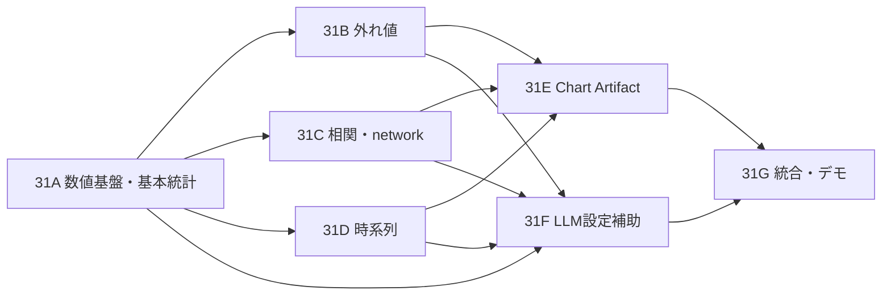

# v31 実装計画: 分析ノード、Chart出力、ローカルLLM設定補助

- Status: In progress (31A, 31B, 31C core/network, 31E artifact viewer, 31F initial UI/API implemented)
- Date: 2026-07-13
- Decision: [ADR-0031](../docs/adr/0031-analytical-nodes-chart-output-and-local-llm-assistance.md)
- Related: [ADR-0027](../docs/adr/0027-tool-output-and-session-workspace.md), [ADR-0028](../docs/adr/0028-structured-node-configuration-ui.md)

## 1. ゴール

Tool Builderで、基本統計量、相関、時系列、外れ値処理をノーコード設定し、表・可視化Chart・property graphとして安全に再利用できるようにする。設定が難しい場合はローカルLLMが設定案を作るが、実行計算と保存済みToolは決定的に保つ。

完了時には次の縦切りが動作する。

1. CSV/JSON/DB sourceから分析nodeを接続する。
2. schema連動Dialogで列と分析方法を設定する。
3. previewで結果表、診断、除外前後の件数を確認する。
4. `chart-output`でChart Artifactを作る、または相関結果を`graph-output`へ保存する。
5. LM Studio設定時だけ、自然言語の目的から設定案とchart案を取得する。
6. 差分とdry-run結果を確認してApplyし、通常のTool保存で確定する。

## 2. 非ゴール

- LLMによる任意コード、Python、SQL、数式の生成・実行
- 保存済みTool実行中のLLMによる設定変更
- 回帰、仮説検定、因果推論、予測、季節分解
- streaming/distributed dataframe engine
- プロジェクトを跨ぐ永続データマート
- Chart Artifact全体をAgent promptへ埋め込むこと

## 3. 追加するモジュール

```text
src/domain/analysis/
  diagnostics.ts
  numeric.ts
  quantile.ts
  ranks.ts
  time-bucket.ts
  summary-statistics.ts
  correlation.ts
  outliers.ts

src/domain/etl/nodes/
  summary-statistics.ts
  correlation-analysis.ts
  time-series-analysis.ts
  outlier-filter.ts
  chart-output.ts

src/domain/chart/
  chart-spec.ts
  chart-codecs.ts

src/application/tool/
  suggest-analysis-config.ts
  profile-analysis-input.ts
  build-chart-artifact.ts

src/api/
  analysis-assistant-routes.ts

src/ui/tool-builder/
  analysis-config/
  AnalysisAssistantDialog.tsx
  ChartOutputDialog.tsx
```

依存方向は`UI -> API -> application -> domain`を維持する。LM Studio adapter、Chart.js renderer、Artifact repositoryをdomainからimportしない。

## 4. 契約変更

### 4.1 ETL node registry

default registryへ次を追加する。

| type | kind | arity | 出力 |
|---|---|---:|---|
| `summary-statistics` | analyze | 1 | group/columnごとの統計表 |
| `correlation-analysis` | analyze | 1 | 列pairごとの相関表 |
| `time-series-analysis` | analyze | 1 | bucket/seriesごとのlong表 |
| `outlier-filter` | analyze | 1 | flag列付き、または除外済み入力表 |
| `chart-output` | sink | 1 | Session WorkspaceのChart Artifact |

保存serializationには各configの`configVersion: 1`を追加する。旧Toolは変更せず読み込めること。`workspace-output artifactKind=chart`と`agent-output format=chartjs`はdeprecatedにせず、互換経路として残す。

### 4.2 Engine診断

現在の`EtlNode.execute(): Table`を破壊せず、省略可能な第3引数として実行contextを追加する。既存nodeの実装と単体呼び出しは変更なしで動作し、Engineだけがrun単位のcollectorを渡す。

```ts
interface NodeExecutionContext {
  report(diagnostic: NodeExecutionDiagnostic): void;
}

interface EtlNode<Config = unknown> {
  execute(inputs: readonly Table[], config: Config, context?: NodeExecutionContext): Table;
}
```

preview結果は`{ table, diagnostics }`を持ち、Tool traceにはbounded diagnosticsを追加する。通常のTool出力payloadへ診断を混在させない。

### 4.3 Chart Artifact

Artifact kind `chart`のpayload codecを`ChartSpecV1`へ固定する。payloadは次を含む。

- `specVersion: 1`
- `chartType`
- title/axis/series mapping
- bounded pointsまたはheatmap cells
- source row count、rendered point count、sampling method
- warnings

`ToolOutputDispatcher`は`chart-output`を検出し、Artifact descriptorを返す。idempotency、TTL、quota、scope分離は既存Session Workspace契約を再利用する。

### 4.4 property graph

`GraphOutputConfig`をversion付きunionへ変更する。

```ts
type GraphOutputMappingV1 =
  | { readonly mode: 'edge-list'; readonly sourceColumn: string; readonly targetColumn: string; readonly edgeLabelColumn?: string }
  | { readonly mode: 'correlation-network'; readonly columnX: string; readonly columnY: string; readonly coefficient: string; readonly pairCount: string; readonly minimumAbsoluteCoefficient: number; readonly minimumPairCount: number };
```

既存の`graph: { sourceColumn, targetColumn }`はdeserialize時に`mode: 'edge-list'`へ移行する。再保存までは元recordを変更しない。

### 4.5 LLM設定提案API

```http
GET  /runtime/capabilities
POST /tool-drafts/suggest-analysis-config
```

request:

```ts
interface SuggestAnalysisConfigRequest {
  readonly scope: TenantScope;
  readonly graph: ToolGraph;
  readonly nodeId: string;
  readonly intent: string;
  readonly includeSamples?: false | { readonly maxRows: number };
}
```

response:

```ts
interface SuggestAnalysisConfigResponse {
  readonly proposal: AnalysisConfigProposalV1;
  readonly validation: {
    readonly schemaValid: boolean;
    readonly previewValid: boolean;
    readonly outputSchema: Schema;
    readonly diagnostics: readonly NodeExecutionDiagnostic[];
  };
  readonly preview: PreviewResult;
}
```

API schemaはgraph、intent、sample上限、node typeを検証する。対象は4つの分析nodeだけにallowlistし、source/output/任意transformへのpatchを拒否する。

## 5. アルゴリズム仕様

### 5.1 共通

- `null`/`undefined`/非有限numberの扱いを各nodeで統一する。
- 入力行順に依存しない統計値と、時刻昇順へ安定sortする時系列値を区別する。
- 数値比較testは絶対・相対toleranceを明示する。
- group keyは型情報を含めて安定serializeし、`1`と`"1"`を同一視しない。
- 元Tableを変更せず、新しいschema/rowsを返す。

### 5.2 基本統計

- count/mean/variance: one-pass accumulator
- quantile: 昇順配列とlinear interpolation
- unique count: 初期版はexact Set。上限超過時はエラーとし、近似値へ暗黙切替しない。
- sample varianceは`n < 2`で`null`

### 5.3 相関

- Pearsonは共分散accumulatorを利用する。
- Spearmanは値をrankへ変換後にPearsonを適用する。
- pairwise/listwiseの対象行集合をtest fixtureで固定する。
- outputは上三角のみ。heatmap rendererが対称成分と対角を補完する。

### 5.4 時系列

- date/datetime以外を拒否する。
- timezoneとcalendar bucketを明示する。
- fill-forwardは同一group/series内だけで行い、先頭欠損は埋めない。
- percent-changeは比較元0のとき`null`と警告にする。
- moving windowはbucket数基準で、時間幅基準と混同しない。

### 5.5 外れ値

- IQR: `[q1 - threshold * IQR, q3 + threshold * IQR]`外を判定する。
- z-score: population standard deviationを仕様として固定する。
- MAD: `median(abs(x - median(x))) * 1.4826`をscaleとして使い、scaleが0の場合は判定不能warningとする。
- 複数列はOR条件。判定理由には該当列とscoreを含める。
- `exclude`でも診断に除外件数と規則snapshotを残す。

## 6. UI設計

### 6.1 Node paletteとInspector

- paletteへ「分析」を追加する。
- 各node cardに用途と入力型制約を表示する。
- Inspectorはquick settingsだけを持ち、「詳細設定」からDialogを開く。
- 上流schema変更で存在しなくなった列はinvalid chipとして表示する。

### 6.2 分析設定Dialog

共通layout:

1. 目的とpreset
2. schema連動の列選択
3. 欠損・group・methodの基本設定
4. 詳細設定
5. 出力schema、診断、bounded preview
6. `Cancel` / `Apply`

外れ値Dialogは`flag`を初期presetにし、`exclude`選択時に除外予定件数を強調する。時系列Dialogはtimezoneを必須表示し、ブラウザーtimezoneを暗黙保存しない。

### 6.3 Chart出力Dialog

分析nodeの出力schemaから利用可能なchart typeを絞る。無効な組み合わせは選択肢から隠すだけでなくbackendでも拒否する。

- 相関表: heatmapを推奨
- time-series long表: line chartを推奨
- outlier flag表: overlay/box plotを推奨
- raw numeric表: histogram/scatterを許可

previewにはsampling badge、元件数、描画点数を表示する。

### 6.4 LLM補助Dialog

`runtime.capabilities.analysisAssistant.enabled`がtrueの場合だけ起動ボタンを表示する。

- ユーザーは「月次売上の傾向を商品カテゴリ別に見たい」など目的を入力する。
- sample送信は既定OFF。ON時は行数上限とマスキング済みであることを表示する。
- 応答後は現在configと提案configのfield単位diffを表示する。
- rationale、assumptions、warnings、dry-run結果を表示する。
- `Apply proposal`でDialogのlocal draftへ反映する。Tool graph保存はしない。

LLM失敗、timeout、schema不適合、preview失敗は既存設定を保持したままエラー表示する。

## 7. セキュリティとプライバシー

- DB接続文字列、environment、SecretReference、認証headerをpromptへ入れない。
- default promptはschemaと集約profileのみを使う。
- raw sampleは明示opt-in、20行、8 KiBの小さい方まで。
- secret-like列名と既存redaction規則でsampleをマスキングする。
- cell文字列を命令として扱わず、非信頼data blockへJSON encodeする。
- LLM応答に含まれる列名は上流schemaとの完全一致を必須とする。
- request/responseの全payloadを通常Run traceへ保存せず、model、duration、token usage、結果状態、proposal hashだけを記録する。
- scope外ArtifactやData Sourceを参照できないことをapplication testで保証する。

## 8. 実装slice

### Slice 31A: 数値基盤と基本統計

- domainのnumeric/quantile/grouping helper
- `summary-statistics` node、registry、schema inference
- 設定Dialogとtable preview
- fixture/golden test

**DoD:** grouped/ungrouped、欠損、四分位、sample/population varianceが既知値と一致する。

### Slice 31B: 外れ値

- IQR/z-score/MAD calculator
- `outlier-filter`のflag/exclude
- before/after diagnosticsとUI警告
- histogram/box-plotに必要な内部変換

**DoD:** flagとexcludeが同じ判定集合を使い、除外件数がtraceとpreviewで一致する。

### Slice 31C: 相関とproperty graph

- Pearson/Spearman、pairwise/listwise
- `correlation-analysis`
- `graph-output` versioned unionとcorrelation-network codec
- 相関fixture、migration test

**DoD:** ties、欠損、ゼロ分散を含むfixtureで相関値と警告が期待どおりになり、相関networkに自己edge/重複edgeがない。

### Slice 31D: 時系列

- calendar bucket、timezone、aggregate、fill、window、lag
- `time-series-analysis`
- DST/月境界/欠損bucket test

**DoD:** timezoneとintervalを固定した同一入力から環境に依存せず同じ出力が得られる。IANA timezone/DSTの暦境界を使い、`zero`/`forward`で欠損bucketを補完する。

### Slice 31E: Chart Artifact

- `ChartSpecV1`、codec、`chart-output`
- ToolOutputDispatcherとSession Workspace連携
- UI renderer、Artifact viewer、sampling表示
- chart typeごとのsnapshot/E2E

**DoD:** 4分析の推奨chartを保存・再表示でき、Agent resultにはdescriptorとbounded previewだけが入る。

### Slice 31F: ローカルLLM設定補助

- capability APIとenv kill switch
- profiler/redactor
- `SuggestAnalysisConfigUseCase`
- strict structured outputと5段階validation
- diff/review/apply Dialog

**DoD:** ScriptedModelProviderで正常案、未知列、壊れたJSON、timeout、prompt injection風sample、scope越境を検証し、不正案がgraphへ反映されない。

### Slice 31G: 統合・文書・デモ

- CSVとDBのdemo data flow
- Playwrightで分析設定、Chart Artifact、LLM proposal reviewを撮影
- 操作マニュアル、API、architecture、`.env.example`を更新
- performance budget計測

**DoD:** demo dataから基本統計→外れ値flag→時系列chart、および相関→heatmap/property graphのE2Eがgreen。

## 9. テストマトリクス

| 層 | 必須test |
|---|---|
| domain | golden値、欠損、空表、定数列、非有限値、group、境界値、入力不変 |
| node | config Zod、schema inference、存在しない列、型不一致、上限 |
| engine | analyze chain、diagnostics伝播、preview cancellation |
| artifact | ChartSpec round-trip、quota、TTL、scope、idempotency、migration |
| application | LLMなし、strict output、dry-run、redaction、proposal非自動適用 |
| API | 400/404/409/502、body上限、AbortSignal、capability表示条件 |
| UI | combobox、transactional Cancel/Apply、diff、warning、i18n、keyboard |
| E2E | 4分析、6chart、相関network、LM Studio有無の両方 |

数値fixtureは外部ライブラリの実行結果をtest時に動的参照せず、レビュー済み期待値をrepositoryへ固定する。

## 10. 品質ゲート

- `npm test`
- `npm run typecheck`
- `npm run depcruise`
- `npm run build`
- analysis Playwright E2E
- `git diff --check`

追加基準:

- 4つのcalculatorはstatement/branch coverage 90%以上
- LLM補助use caseは正常・不正・timeout・privacy経路を100%列挙
- 30列相関、1,000 group、5,000 chart点で上限が機能する
- LLM未設定時に補助UIが表示されず、手動分析は正常動作する

## 11. 実装順序



LLM補助は各nodeのconfig validatorとpreviewが完成してから接続する。先にpromptを作ると、不正提案を判定する基準がないためである。
