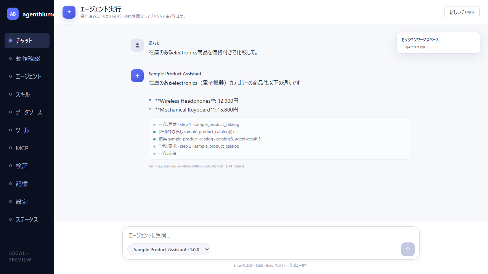
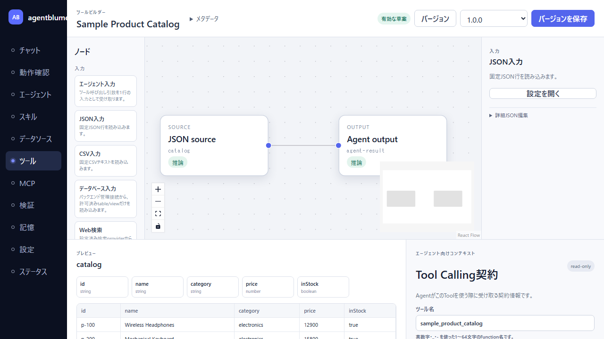
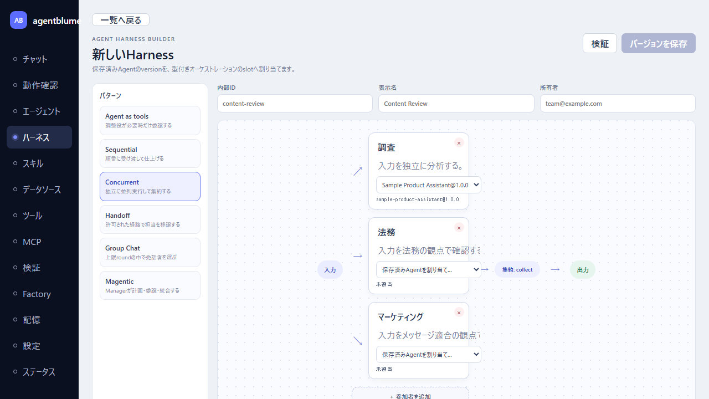
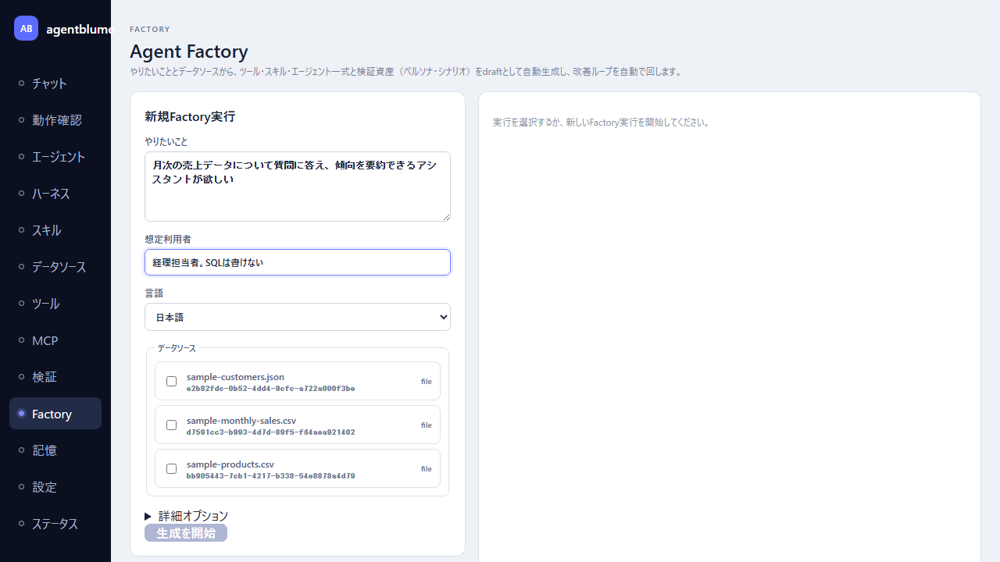
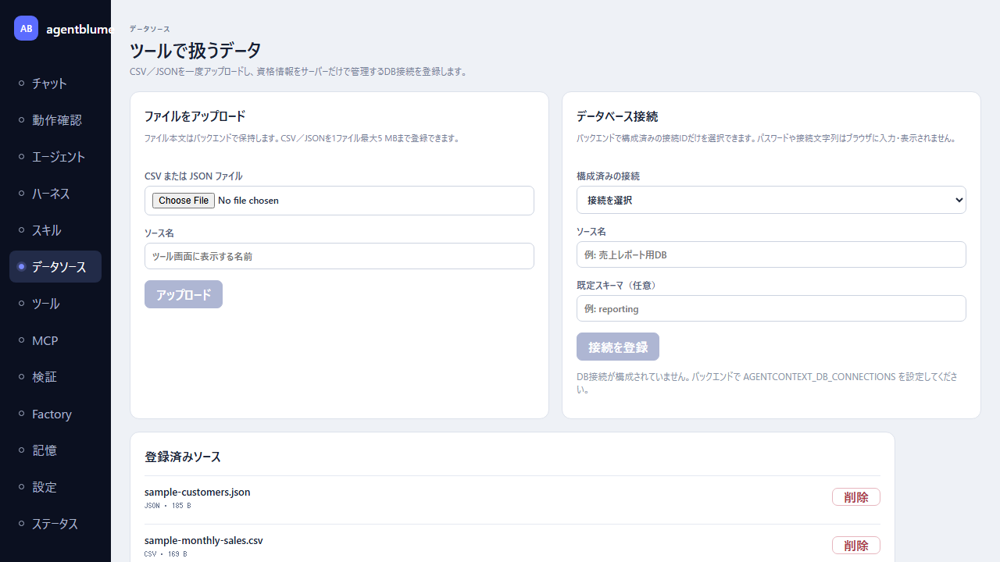
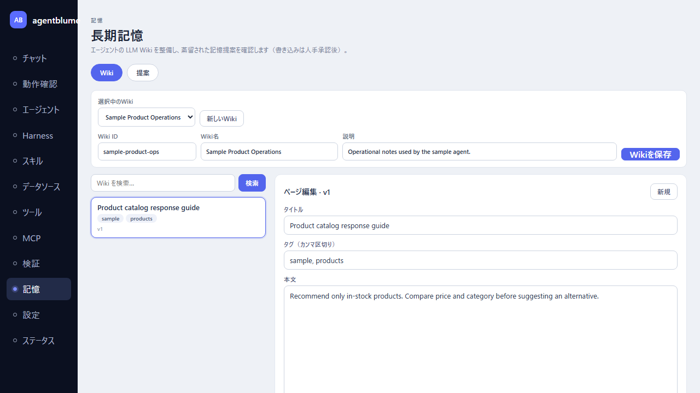

# agentblume

ノーコードでAIエージェントを組み立て・実行・検証するためのローカルIDE。ETLツールエンジンを中心に、エージェント／スキル／ツールの定義、動作確認、検証を1つのUIから行える。

- **スタック**: TypeScript / React 19 / Fastify / Vite / Vitest / Playwright
- **状態**: プレビュー（ローカル実行向け）

## 画面

サンプルデータを投入して実行中のアプリ（日本語UI）。画像は `npm run docs:screenshots` が実画面を操作して再生成する。操作手順は[デモデータ操作マニュアル](docs/13-demo-operation-manual.md)を参照。

| | |
|---|---|
| **チャット** — 保存済みAgentがToolを呼び出して応答（ライブモデル実行）  | **Tool Builder** — ETLノードフローの編集と固定サンプルプレビュー  |
| **Harness Builder** — マルチエージェント構成をパターン別の構造図で編集（Concurrentのfan-out＋集約）  | **Agent Factory** — やりたいこと＋データソースからAgent一式を自動生成・自動改善  |
| **データソース** — CSV/JSON登録とDB接続カタログ  | **長期記憶** — Wikiページの編集・検索とAgentへのアタッチ  |

## 必要なもの

| | 要件 | 備考 |
|---|---|---|
| **Node.js** | **22.9.0 以上**（`.nvmrc` は 22.19.0） | 組み込みSQLite（`node:sqlite`）が 22.5.0 以降、`.env` 読み込みに使う `--env-file-if-exists` が 22.9.0 以降。`package.json` の `engines` にも明記している |
| **npm** | Node 同梱のもの | |
| **PowerShell 7+** (`pwsh`) | 開発用スクリプトのみ | 本番起動（`npm start`）には不要 |
| **LM Studio**（任意） | Agent実行・Factory・評価を動かす場合 | OpenAI互換サーバーを起動し、モデルをロードしておく。既定の接続先は `http://127.0.0.1:1234/v1`。未設定でもUI・Tool Builder・データソースは動く |

セットアップ:

```powershell
nvm use          # .nvmrc がある場合
npm install
copy .env.example .env   # 任意。設定を書き換える場合
```

`.env` はAPIプロセスが Node の `--env-file-if-exists=.env` で読む（無くてもエラーにならない）。
**シェルに既に設定されている環境変数は `.env` より優先される。**
読まれるenvの全量と既定値は [.env.example](.env.example) にある。起動時に全項目をまとめて検証し、
不正な値があれば「どの変数の、どの値が、何を期待されているか」を並べて起動を中止する。

## ローカル開発

PowerShellからAPIとUIをまとめて起動する。UIはVite開発サーバー（5173）が配信し、APIへはプロキシする。

```powershell
.\scripts\start-dev.ps1
```

ツール、スキル、エージェント、Wiki、CSV/JSONデータソースを含めて手動確認する場合は、専用のサンプルデータを投入して起動できる。既存IDがある場合は再作成しない。

```powershell
npm run dev:sample
# または .\scripts\start-dev.ps1 -SampleData
```

サンプルデータは既定の永続DBへ投入される（既存データは上書きしない）。使い捨てにしたい場合は `AGENTCONTEXT_DB_PATH=:memory:` を指定する。

画面付きの起動・操作・ライブAgent実行手順は[デモデータ操作マニュアル](docs/13-demo-operation-manual.md)を参照。

既定はAPI `3030`、UI `5173`。使用中の場合は既存プロセスを自動停止せず、起動前にエラーを返す。別ポートで起動する場合:

```powershell
.\scripts\start-dev.ps1 -ApiPort 3031 -UiPort 5174
```

主なオプション:

- `-Profile local|test`
- `-ApiOnly` / `-UiOnly`
- `-SampleData`: 手動確認用のCSV/JSON、Tool、Skill、Agent、Wikiを投入する。
- `-ApiPort <1-65535>` / `-UiPort <1-65535>`
- `-DryRun`: 子プロセスを起動せず、実行予定のコマンドと接続先を表示する。
- `-Stop`: API/UIポートを占有している開発プロセス(このリポジトリ由来と判定できたもの)を停止して終了する。異常終了などで残留したプロセスの掃除に使う。

テストと検証:

```powershell
npm test
npm run test:e2e
npm run typecheck
npm run depcruise
npm run test:cov
npm run build
```

`test:e2e` 以外は GitHub Actions（`.github/workflows/ci.yml`）が push(main) と pull request で
`ubuntu-latest` 上でも回す。e2e は所要時間が長く、まだ Actions 上での安定性を確認できていないため
`.github/workflows/e2e.yml` の**手動トリガー**（Actions タブ → E2E (manual) → Run workflow）にしてある。

## ビルドと本番起動

```powershell
npm run build   # UI（dist/ui）とサーバー（dist/server）の両方を出力する
npm start       # dist/server/server.js を node が直接実行する（tsx は開発専用）
```

`npm start` は `dist/ui` を見つけるとAPIと**同じポート**からUIを配信する。ブラウザで
`http://127.0.0.1:3030` を開けばそのまま使える（Vite開発サーバーは不要）。
`dist/ui` が無ければAPIだけを提供する。開発用の `npm run serve` は `dist/ui` を配信しない
（古いビルドを掴むとソースを直しても画面が変わらないため）。UI付きで確認したいときは `npm start` を使う。

| エンドポイント | 用途 |
|---|---|
| `GET /health` | liveness。プロセスが生きているかだけを見る（依存は叩かない）。落ちたら再起動する判断に使う |
| `GET /ready` | readiness。DBへ実際に読み取りを1本通す。失敗時は `503` と失敗した依存名を返す |

どちらも `AGENTCONTEXT_SOURCE_REVISION` を設定していれば `revision` を返すので、
「今動いているのがどのビルドか」を外から確認できる。

補足:

- 既定のlistenは `127.0.0.1:3030`。別マシンから触らせる場合は `AGENTCONTEXT_HOST=0.0.0.0`。
  **認証はまだ実装していない**ので、公開網へは直接出さないこと。
- Agent実行・Harness実行（最大1時間）はHTTPリクエストの中で動く。この経路を切らないため、
  Fastifyの `connectionTimeout`（無通信でソケットを切る設定）は無効のままにしている。
  リバースプロキシを挟む場合は、そちらのタイムアウトも長時間実行に合わせる必要がある。
- ビルド成果物（`dist/`）は `.gitignore` 済み。

### 停止（graceful shutdown）

`Ctrl+C`（SIGINT）または SIGTERM で停止する。処理中のHTTPリクエストを終わらせたあと、
**実行中**の実験・Factory Runの完了を既定10秒まで待ってから中断する
（`AGENTCONTEXT_SHUTDOWN_GRACE_MS` で変更、`0` なら待たない）。
待たずに落としたいときは **もう一度 `Ctrl+C`** を押すと猶予を打ち切って即終了する。

> ジョブの永続化と再起動後の再開はまだ実装していない。猶予を過ぎて中断されたジョブは
> 失敗として記録され、再開されない。長い実験の最中は停止を避けること。

## データの保存先

作成したTool・Skill・Agent・Wiki・実行履歴・モデル設定は SQLite に保存する。

- 既定の保存先は **`~/.agentblume/agentblume.db`**（親ディレクトリは自動作成）。起動時にログへ実際のパスを出す。
- 別の場所に置く場合は `AGENTCONTEXT_DB_PATH` を設定する。
- `AGENTCONTEXT_DB_PATH=:memory:` を指定したときだけ、プロセス終了で全データが消える（使い捨て検証用）。
- スキーマは起動時に自動でマイグレーションする。DBがこのビルドより新しい場合は、データを壊さないよう起動を中止する。
- UIから保存したAPIキーは暗号化して保存し、鍵は `~/.agentblume/secret.key`（`AGENTCONTEXT_SECRET_KEY_PATH` で変更可）に置く。**DBファイルをバックアップ・共有するときは鍵ファイルを一緒に運ばない**こと。
- DBファイル・鍵ファイルは `.gitignore` 済み。

読まれている環境変数の全量は [.env.example](.env.example) を参照。

## データソースとDB接続

CSV/JSONは「データソース」画面で登録し、Tool Builderのsourceノードから選択できる。DB接続情報とパスワードはbrowserに入力せず、backend環境変数で管理する。

- 設定例: [.env.example](.env.example)
- DBはPostgreSQLの読み取り専用sourceに対応する。`allowedTables`に列挙したtable/viewだけを、行数上限付きで読み取る。
- 任意SQL、書き込み、資格情報のUI入力・API返却は提供しない。

設計上の安全境界は[ADR-0029](docs/adr/0029-data-source-registry.md)を参照。

Web検索sourceは、Tavily、TinyFish、Google Custom Searchのキーをbackend環境変数で有効化して利用する。設定されていないproviderはTool Builderに表示されず、検索は作成者の「検索結果を取得」操作でだけ実行する。結果は15分のサーバー内キャッシュとしてTool graphから参照する。自動更新・永続キャッシュ・利用量予算は後続範囲であり、詳細は[ADR-0030](docs/adr/0030-optional-web-search-providers.md)を参照。

## ライセンス

[MIT License](LICENSE) © 2026 yy7613
